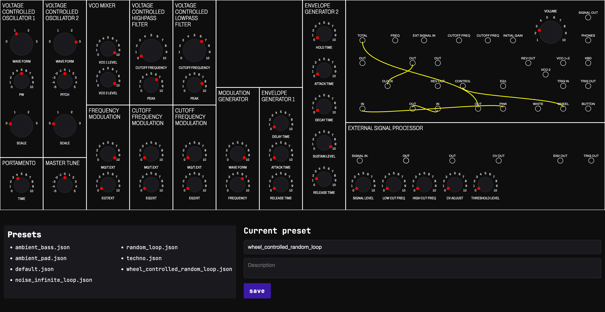

# Korg MS20-mini savestates

> Create and save korg ms20-mini patches :sparkles: 



:bulb: I wanted a simple tool to save my patches, without having any actual VST. 

:warning: This is only intended to save knob values and patches, not to play with sounds.

## How to use

This project uses nuxt 3 (node & npm / yarn are required).

To get the project running, run these commands in your terminal:

```bash
git clone https://github.com/AlbanCrepel/korg-ms20-mini-savestates.git # cloning the project
cd korg-ms20-mini-savestates # moving to the project directory
yarn install # install dependencies
yarn dev # Run the project inside your browser
yarn build # Build static files to serve for production
```

:floppy_disk: When saving patches, place the json file in the `content` folder to get listed in the user interface.

---

:heart: You can contribute to my open-source projects with github donations or via [Ko-fi](https://ko-fi.com/alban_crepel#).
